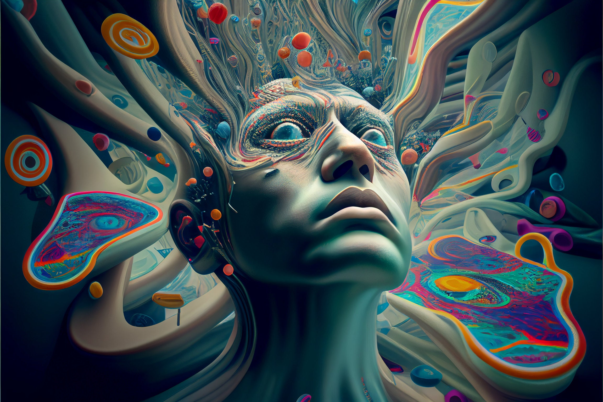
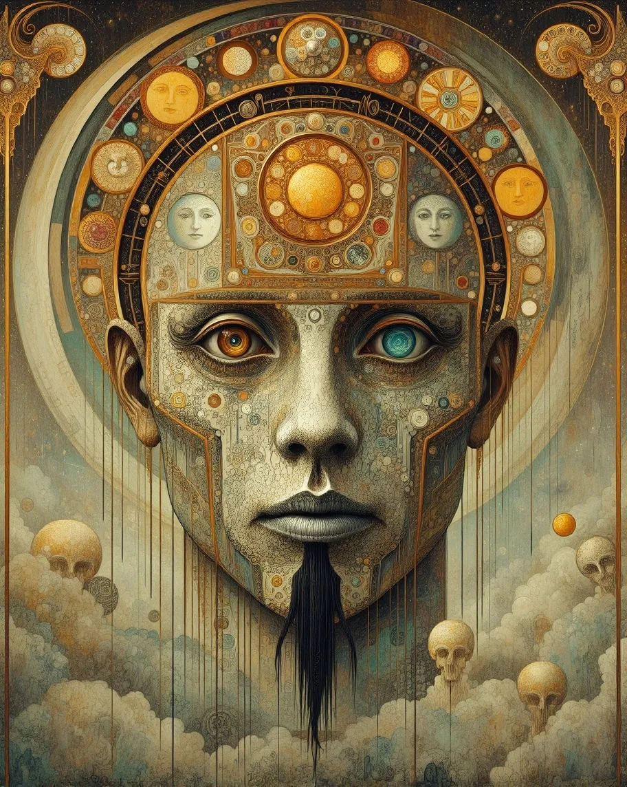
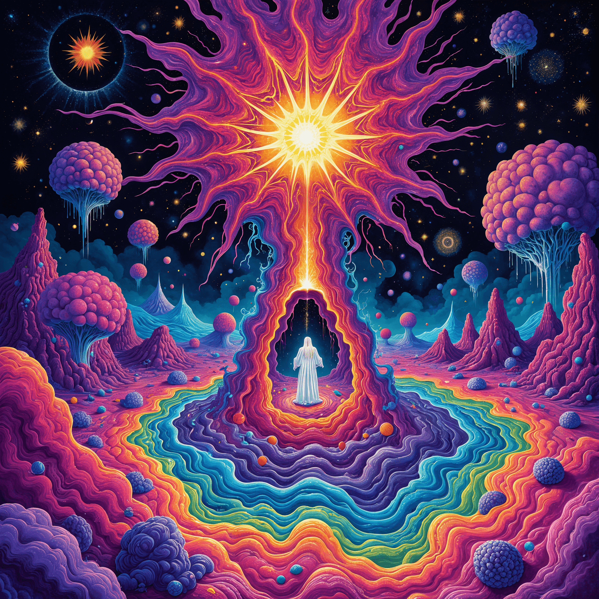
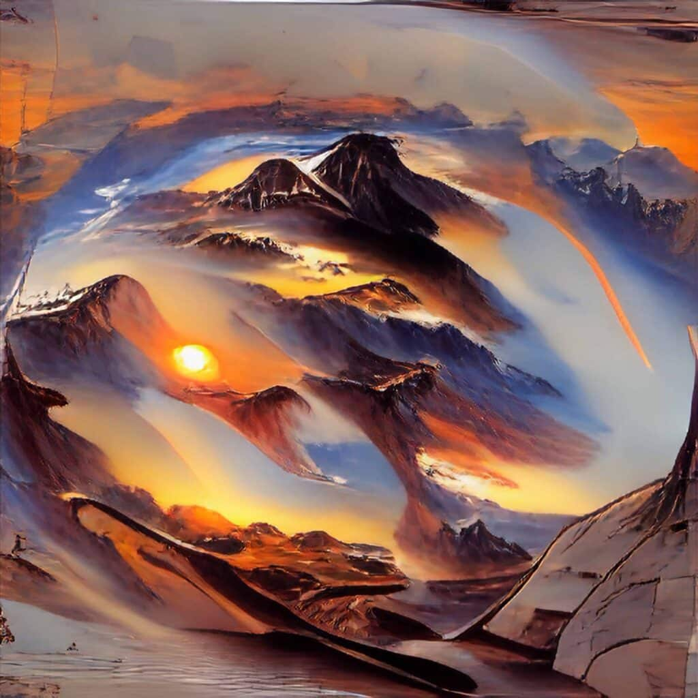

# Likely pipelines (from most to least probable)

**User:**

Title: GA-psychadelic-ai-art

I'm getting a little burned out thinking about coding apps and productivity tools.  Can  you point me to some cool AI art to re-stimulate and motivate me to keep going and learning?  Preferably, really psychadelic and colorful stuff

---

**ChatGPT:**

Great call — taking a creative detour into vivid, psychedelic AI art can be a seriously refreshing way to reinvigorate your coding/productivity mindset. Below are some colourful examples and tools to explore, plus a couple of quick prompts you can drop into your favorite image generator for instant inspiration.

### 🎨 Sample visuals

Here are some eye-catching, brain-calming visuals. Let their bold colour palettes, flowing forms and surreal details reset your creative brain for a bit.

### 🔧 Tools & Resources

* The site “StarryAI” has a gallery of 100+ psychedelic-style AI-generated art pieces you can browse for inspiration. [starryai](https://starryai.com/app/search/AI%20Psychedelic%20Art?utm_source=chatgpt.com)
* The “NeuralFrames” Trippy Visuals Generator allows you to input a text prompt and produce “fractal landscapes to psychedelic shapes” fairly quickly. [Neural Frames](https://www.neuralframes.com/trippy-visuals?utm_source=chatgpt.com)
* A good walkthrough of how to craft psychedelic AI art (using tools like DeepDream, diffusion models, prompts etc) is in this Medium article: “How To Create Psychedelic AI Art”. [Medium](https://medium.com/geekculture/how-to-create-psychedelic-ai-art-170b740c6aa8?utm_source=chatgpt.com)

### 🧠 Prompt ideas you can paste

* *“Ultra-vibrant kaleidoscopic fractal landscape, neon pinks and turquoise swirls, high detail, digital painting, surreal cosmic vibe”*
* *“Portrait of ethereal being, melting geometry, psychedelic colour explosion, glowing eyes, detailed patterns”*
* *“Trippy alien cityscape at night, holographic colours, reflections, dreamy, mind-bending architecture”*

Feel free to tweak them with your favourite terms (e.g., “dreamlike”, “intricate mandala”, “symmetry”, “liquid shapes”) until something really grabs you.

### ✅ Why this helps

* The brain often gets stuck in “linear productivity” mode. Shifting into a space of abstract visuals helps loosen cognitive constraints and can spark new associations (useful when you return to coding/productivity tools).
* Rich, colourful, unexpected visuals engage different parts of your brain (imagination, pattern recognition) that aren’t always used for “tool-building” work — a kind of creative reset.
* It connects with your “glimmers of hope” concept (you mentioned drums, Anki flashcards, HearEQ quizzes) — treat this art time as another positive ritual to refresh your state.

If you like, I can **curate a full gallery of ~20 high-resolution psychedelic AI art pieces** (free to download or license) and **generate a pack of 10 custom prompts** tuned for your vibe (bright, abstract, fractal, high detail) that you can drop into your own flow. Want me to pull that together for you?

---

**User:**

this is kinda cool.  but I was thinking more like this guy
https://www.instagram.com/hellopersonality/

Can you see his/her content.  Let me know and if not,  I'll attach some examples.

---

**ChatGPT:**

## Personality (Instagram handle: @hellopersonality)

Yes—I was able to view the profile you mentioned: **@hellopersonality** on Instagram. [instagram.com+2instagram.com+2](https://www.instagram.com/hellopersonality/?hl=en&utm_source=chatgpt.com)
Here’s a breakdown of what I found and how you might use it as inspiration:

### ✅ What I found

* The page identifies the artist as “Personality” (or “Hello, Personality”). At the top of their profile it says: *“AI ANIMATIONS”*. [instagram.com+1](https://www.instagram.com/hellopersonality/reels/?utm_source=chatgpt.com)
* Their body of work is extremely psychedelic, vibrant, generative, fractal-influenced, high motion, very colourful. For example, they describe their style as “fast, chaotic and psychedelic” and mention “flying fractal rollercoasters and trippy computer lucid dreams.” [Visual Atelier 8](https://visualatelier8.com/computer-lucid-dreams-by-personality/?utm_source=chatgpt.com)
* The feed includes posts combining animation/video, and stills with heavy visual effect, often surreal, reflective of deep-dream / fractal aesthetics. (E.g., posts titled “Liquid Light Flash … #dream #streetphotography #driving” etc.) [instagram.com+1](https://www.instagram.com/p/DK6K8AuimFX/?utm_source=chatgpt.com)
* They post frequently (daily, or at least very regularly) and appear to iterate a lot (“lots and lots of trial and error … tweaking each setting bit by bit…”). [Visual Atelier 8](https://visualatelier8.com/computer-lucid-dreams-by-personality/?utm_source=chatgpt.com)

### 🎯 Why this is relevant to you

Given your burnout around coding/productivity tooling and your interest in “really psychedelic and colorful stuff,” this artist aligns well:

* The style is **visually intense**, which can act as a strong “reset” for the brain whenever you step away from logic/code-work.
* Their workflow shows **iteration, experimentation, generative art**, which parallels your interest in building systems (like AI pipelines, Web apps, etc). It’s a different domain, but the mindset overlaps: tweak, test, iterate, create.
* You could use their work as a *creative spark*. For example: look at one of their pieces, ask yourself “what code / algorithmic idea might generate something like this?”, or just let the aesthetic refresh your internal state before diving back into your dev tasks.

### 🤔 Next step

If you like, I can **pull together a curated mini-gallery of ~15 works by Personality** (with high resolution where possible) and annotate them with what kind of generative techniques may have been used (e.g., fractals, deep-dream, neural style transfer, animation loops). Then we can derive **5 prompt templates** you can plug into your generative system (e.g., Colab + diffusion model) that are explicitly inspired by their style — and maybe tie those into your workflow as “10-minute creative breaks” you schedule when you feel the burnout creeping.
Would you like me to do that?

---

**User:**

yes, "visual intensity" is what I'm aiming for.  He doesn't post his workflow.  Could you search to see if there was anything he/she posted else-where, and if not, infer on what a workflow like this consists of?  Include any tools he/she may have used, paid or free, open-source (comfyUI) or closed.  

And that questioning is exactly my thinking: "what code / algorithmic idea might generate something like this?"  How was this ACTUALLY done, algorithmically or otherwise?

---

**ChatGPT:**

Love it — “visual intensity” is exactly the right phrase for @hellopersonality. I checked what’s public and found only sparse direct workflow info; the Instagram bio just says “AI ANIMATIONS,” and there’s a short 2021 feature describing “flying fractal rollercoasters and trippy computer lucid dreams,” but no step-by-step process. [instagram.com+1](https://www.instagram.com/hellopersonality/?utm_source=chatgpt.com)
A few reels also reference road footage / street photography aesthetics, and musician Jordan Rudess mentions a collab “using fractal AI,” which hints at fractal + post-processing or AI stylization rather than pure hand-modeled 3D. [instagram.com+2instagram.com+2](https://www.instagram.com/hellopersonality/reel/DHmXwUnsM2u/around-youpsychedelicart-streetphotography-roadtrippin-motorcycle-motorcycles/?hl=en&utm_source=chatgpt.com)
Here’s a best-effort reconstruction of **how this look is plausibly made**, with concrete tool chains you can try today.

# Likely pipelines (from most to least probable)

## 1) Video-to-AI stylization (street/POV → trippy diffusion)

**Idea:** shoot (or source) short driving/walking clips → stylize with diffusion while preserving motion/edges → add kaleidoscopic symmetries + glow.
**Stack (free/OSS first):**

* **ComfyUI** with **AnimateDiff** (or **LCM**) + **ControlNet (Depth/Normal/OpenPose)** for structure lock, **IPAdapter** for motif guidance, **optical-flow consistency** nodes (e.g., FILM/RIFE pre/post).
* **Stable Diffusion 1.5/XL** checkpoints tuned for psychedelic color (or your own LoRA).
* **After Effects** (paid) for **Mirror/Kaleidoscope**, **Glow (Deep Glow/Video Copilot Optical Glow)**, **RGB split**, **rolling-shutter wobble**, and **music sync**.
* **Topaz Video/Chronos** (optional) for upscale/slomo. **Why it matches:** Lots of posts feel like IRL footage “morphed” into neon dreamspace, yet camera paths remain believable — a hallmark of ControlNet-guided stylization.

## 2) Fractal-first + compositing (the “fractal AI” clue)

**Idea:** generate evolving fractal fields → mirror/tile → composite as worlds/tunnels → color-cycle and bloom.
**Stack:**

* **Mandelbulb3D / JWildfire / Chaotica** (fractal explorers, many free/cheap).
* **TouchDesigner** (real-time feedback, Kaleidoscope TOP, optical-flow feedback, audio reactivity).
* **After Effects** (+ Trapcode **Particular/Tao**, Mirror, Turbulent Displace, CC Kaleida) to build **rollercoaster camera** through fractal “tunnels.” **Why it matches:** The Rudess note explicitly says “fractal AI.” Also the 2021 feature frames the work as “fractal rollercoasters / computer lucid dreams.” [Facebook+1](https://www.facebook.com/jordanrudessofficial/videos/digital-art-by-hello-personality/237798018478628/?utm_source=chatgpt.com)

## 3) 3D base + shader feedback (less likely but feasible)

**Idea:** simple 3D corridors/roads in **Blender/Houdini**, then heavy **GLSL/feedback** (TouchDesigner/Notch) and diffusion-style passes for painterly detail.

# What’s happening algorithmically

* **Fractal fields / escape-time & IFS:** Iterating z→f(z)+c in ℂ or ℝ³ (e.g., Mandelbulb power-n) gives infinite detail; keyframed parameters yield “tunnel” zooms and morphs.
* **Kaleidoscopic symmetry:** Tiling/mirroring applies dihedral/cyclic groups to duplicate motifs instantly—why those perfect radial symmetries “pop.”
* **Diffusion stylization with structure locks:** AnimateDiff (temporal prior) + ControlNet (Depth) forces the model to paint wild textures/colors while **keeping scene geometry & motion**; optical-flow guidance/interpolation reduces flicker.
* **Feedback & displacement:** Iteratively warping frames by noise/flow fields (TouchDesigner/AE Turbulent Displace) yields liquid, self-similar motion that feels “alive.”

# Concrete builds you can run

## A. ComfyUI “Psychedelic Stylizer” (video → video)

1. **Pre-process:** extract frames (ffmpeg), optional **RIFE/FILM** to 60 fps.
2. **Nodes:** * Loader → **Depth Map** (MiDaS/Zoe) → **AnimateDiff** (base SDXL/1.5) * **ControlNet (Depth)** strength ~0.65; **IPAdapter** with a colorful reference; **CFG 3-5**, **denoise 0.35–0.5** * **Prompt:** “ultra-vibrant kaleidoscopic fractal textures, neon magentas/cyans, glowing ink, surreal cosmic painting, high detail”
3. **Post:** **AE** Mirror/Kaleida, Optical Glow, slight **time echo**; grade with **Hue cycles** and **Curves**.
4. **Export:** ProRes/DNxHR; optional Topaz upscale.

## B. Fractal tunnel + AE

1. **Chaotica** (or Mandelbulb3D): animate 2–3 parameters (power, rotation, camera Z) for 10–20 s.
2. **AE:** CC Kaleida (tiling), **Turbulent Displace** (flow), **Particular/Tao** accents, **Optical Glow**; speed-ramp beats.
3. **Optional:** run final through ComfyUI **LCM** as a **light style pass** (low denoise 0.15–0.25) to add painterly texture without killing edges.

## C. TouchDesigner real-time trip

* **Kaleidoscope TOP → Feedback TOP → Displace TOP** (noise/flow) → **HSV Adjust**.
* Feed IRL clip to **Optical Flow** for motion warps; record or NDI into AE for polish.

# Tools checklist

**Open-source / free**

* ComfyUI (+ AnimateDiff, ControlNet, IPAdapter, MiDaS/Zoe depth, RIFE/FILM)
* Mandelbulb3D, JWildfire, Chaotica (non-OSS but inexpensive), Blender
* ffmpeg

**Paid (use trials where possible)**

* After Effects (+ Deep Glow/Optical Glow, Trapcode Particular/Tao)
* Topaz Video AI / Flowframes (interpolation/upscale)
* TouchDesigner (Non-Commercial is free; Pro adds out/record features)

# Mini-prompts (drop in as styles/modifiers)

* “**psychedelic fractal tunnel, neon magenta/cyan, mirror-symmetry, glowing ink and oil marbling, ultra-high detail, cinematic bloom**”
* “**kaleidoscopic street at night, liquid chrome reflections, optical-flow motion, cosmic color grading, surreal lucid dream**”
* “**hyper-saturated mandala cityscape, fluid geometry, prismatic dispersion, painterly diffusion texture**”

# What we **do** know vs. what we’re inferring

* **Known (public):** Instagram brand as *AI animations*; artist self-describes as *fractal rollercoasters / computer lucid dreams*; at least one collab cites “fractal AI.” [instagram.com+2Visual Atelier 8+2](https://www.instagram.com/hellopersonality/?utm_source=chatgpt.com)
* **Inferred:** The three pipelines above, with diffusion-based stylization or fractal generation + compositing to hit the exact **symmetry, neon color, liquid motion** vibe.

If you want, I’ll spin up a **ready-to-run ComfyUI workflow JSON** for Pipeline A (AnimateDiff + ControlNet Depth + IPAdapter + frame IO), tuned for 10–15 s clips at 720p/1080p on your RTX 6000 — plus a tiny **AE preset stack** (Mirror/Kaleida/Glow) you can import.

---

**User:**

this is great!  particularly with Touchdesigner which we've spoken about before regarding programmatically generating visual effects depending on music/sound/midi/motion capture produced during a live performance.  I'd like to re-explore this and link these two ideas, but keep open other fractal explorers.  Can Touchdesigner do what fractal explorers do?  If not, can they work synergistically?

---

**ChatGPT:**

oh yes—TouchDesigner (TD) is a perfect hub for this. short answer:

* **Can TD do what fractal explorers do?** **Partly, yes.** TD can render many fractal styles **in real-time** via **GLSL shaders** (2D Mandelbrot/IFS, 3D ray-marched Mandelbulb/Mandelbox, noise/fractal-Brownian-motion fields), plus kaleidoscopes, feedback tunnels, optical-flow warps, etc. **But** dedicated fractal apps (Mandelbulb3D, Chaotica, JWildfire) still win for **ultra-high detail, deep zooms, exotic formulas/orbit traps, and offline quality** (long renders, supersampling, path-traced looks).
* **Do they work synergistically?** **Absolutely.** Use TD for **real-time control, audio/MIDI/OSC mapping, scene switching, feedback, post-fx, and show control**, and let a fractal explorer do **offline “hero” clips** or **pre-cooked loops** that TD manipulates live.

# Three solid ways to fuse them

## 1) TD-native, shader-based fractals (fastest for live)

**What:** Implement fractals directly in TD using **GLSL TOP** (2D) or **Ray Marching GLSL** (3D SDF/Mandelbulb), then TD handles audio/MIDI reactivity and post-effects.
**Pros:** One app, deterministic low latency, endless mapping; scales with your RTX 6000.
**Cons:** You (or I) must author/port GLSL (totally doable).
**Core TD chain (TOPs):**
Audio Device In CHOP → Analyze/Filter CHOP → (export to) GLSL TOP uniforms (e.g., `power`, `bailout`, `julia_c`, `time`) → **Kaleidoscope TOP** → **Feedback TOP** → **Displace TOP** (Noise/Optical Flow) → **Levels/HSV** → **Out TOP**
**Add:** MIDI In Map CHOP for scene/preset switching; Beat CHOP for musical quantization.

## 2) Fractal explorer pre-renders + TD as live “remixer” (most flexible)

**What:** Render 10–30 s loops from **Chaotica/JWildfire/Mandelbulb3D** (HAP-Q, ProRes, or image sequences). Bring into TD, then add kaleidoscopes, feedback, time-warps, hue cycles, strobe/blur, and blend multiple loops keyed by audio/MIDI.
**Pros:** Best visual richness; TD focuses on **performance mixing**, transitions, and FX; low GPU cost.
**Cons:** Not infinitely improv-able unless you render many variations ahead of time.

## 3) Hybrid: TD drives external fractal engines

**What:** TD analyzes audio/MIDI → sends values via **OSC/MIDI/command-line** to tools that accept live params (e.g., **Fragmentarium** or a small **custom GLSL/Metal/VK app**). The external renders to **Spout/Syphon/NDI/HAP**, TD receives and post-processes.
**Pros:** Leverage specialized renderers but keep TD as the show brain.
**Cons:** Setup glue varies by tool; not all fractal apps expose live controls.

# Practical build: “Visual Intensity Rig v1” (TouchDesigner)

**A. Inputs & control**

* **Audio Device In CHOP** (mic/loopback) → **Band EQ CHOP** (split into Sub/Kick/Snare/Hi) → **Envelope + Filter CHOP** (smooth) → **Math CHOP** (normalize 0–1)
* **MIDI In Map CHOP** for pads/knobs (StreamDeck/MIDI Fighter)
* **Beat CHOP** to quantize events (1/4, 1/8, 1 bar)

**B. Core visuals (choose 1 or combine):**

1. **GLSL fractal TOP** (2D Mandelbrot/Julia or 3D SDF raymarch): expose uniforms * `cRe, cIm` (Julia), `power`, `bailout`, `scale`, `cameraAngle`, `time`, `colorCycle` * Map: Kick→`scale` micro-pumps; Snare→`colorCycle` jumps; Knob→`power` sweep.
2. **Pre-render input** (Movie File In TOP) from Chaotica/MB3D loops.

**C. Post-FX stack**

* **Kaleidoscope TOP** (order 6–12) → **Feedback TOP** (Comp: Add/Over, with **Level TOP** in the loop to prevent blowout) → **Displace TOP** (Noise TOP whose amplitude is audio-driven) → **Optical Flow TOP** (optional motion smear) → **Bloom/Glow** (via Levels + Blur + Add) → **Levels/HSV** (macro color rides)

**D. Routing & output**

* **Switch TOP** for scene toggles (MIDI button)
* **Cross TOP** to fade between fractal sources
* **Out TOP** to projector/LED wall/NDI; **Movie File Out TOP** (record)

**E. Presets**

* Store mappings/presets in a **Table DAT** per scene (rows = parameter name, columns = base/min/max/curve), and a small **Python callback DAT** to load/save per MIDI pad. This keeps you from losing settings across machines.

# Fractal explorer picks (to pair with TD)

* **Chaotica** – slick keyframe animator, clean loops, good AA; great for smooth tunnels and parameter morphs.
* **JWildfire** – IFS flames with deep parameter space; wild color.
* **Mandelbulb3D** – 3D bulbs/boxes, dramatic “cathedral” tunnels; heavier render times.
* **Fragmentarium** (GLSL) – shader-based fractals; good bridge to TD if you want “live-ish” control.

**Workflow tip:** pre-render 8–12 loops at 8–20 s each (two colorways per loop), export as **HAP-Q** (alpha if needed). In TD, build **Banks** (folders) and a **random-but-musically-quantized** scene selector.

# If you want TD to fully replace a fractal explorer

* Implement **GLSL Mandelbulb ray marching** in a **GLSL TOP**: sphere tracing with distance estimator; uniforms for `power`, `iterations`, `bailout`, `scale`, `rot`, and **AO/soft-shadow approximations**.
* Add **temporal supersampling** (render at higher internal res via **Resolution TOP** and downsample) to reduce shimmer.
* Use **Color Look-Up TOP** (LUT) or **Palette** to nail “neon ink” looks quickly.
* Your RTX 6000 Blackwell can comfortably push **1080p60–1440p60** with moderate iterations; 4K may need lighter steps or variable iteration counts based on audio load.

# Integration with your broader plan

* **TD ↔ ComfyUI**: not real-time, but you can render TD passes, then batch a **diffusion stylization** pass in ComfyUI (low denoise 0.15–0.3) for painterly texture; re-import to TD for live mixing.
* **MoCap/MIDI**: TD can ingest **MIDI, OSC (from Ableton), and mocap** (Kinect, Rokoko, Move AI). Map body joints to fractal params (e.g., right hand height → `power`, hip rotation → `kaleidoscope angle`).

## Your next 60-minute sprint

1. In TD: build **Audio Device In → Band EQ → Filter** and expose channels `kick`, `snare`, `hat`, `bass`.
2. Drop a **GLSL TOP**; load a Mandelbrot shader (I can provide one next) and link `kick` to zoom/scale, `snare` to color phase, a MIDI knob to Julia `c`.
3. Add **Kaleidoscope → Feedback → Displace**. Tweak Displace amplitude with `bass`.
4. Import one **Chaotica loop** (or any fractal clip) and set a **Cross TOP** to A/B between shader and pre-render on a MIDI button.
5. Save a **preset DAT** row for each scene.

If you want, I’ll prep:

* a **TD .tox component** with the full chain + preset table + CHOP mappings, and
* a **starter GLSL fractal shader** with commented uniforms tailored for audio/MIDI control.

Which route do you want to lock in first—**TD-only GLSL**, **pre-rendered fractal loops remixed in TD**, or **hybrid**?

---

